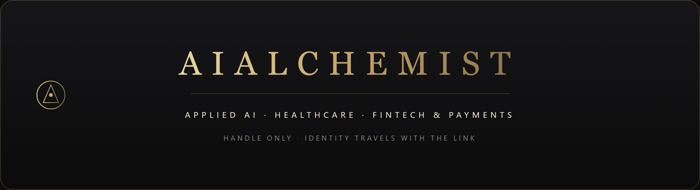
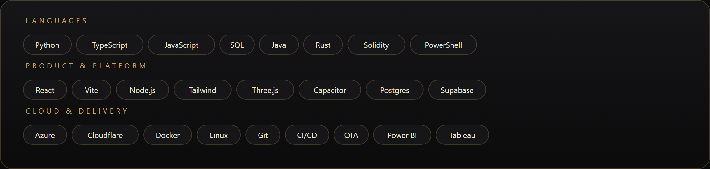
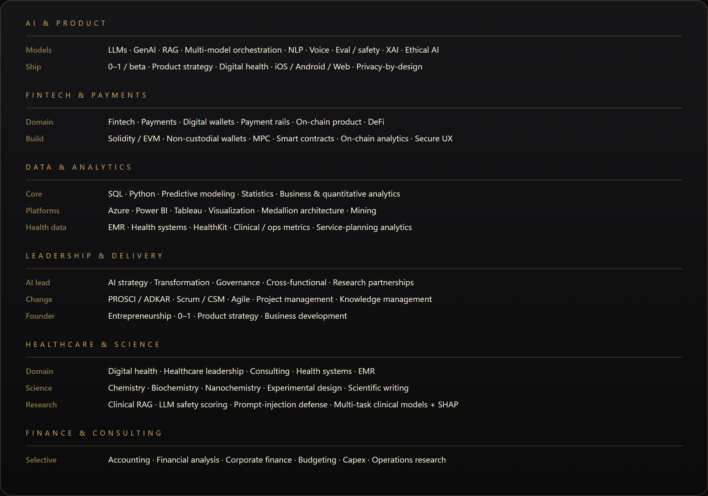

  

 

  

 

  

 

  

## Open source

| Org | Pull request | Change |
|-----|----------------|--------|
| [cloudflare/cloudflare-docs](https://github.com/cloudflare/cloudflare-docs) | [#32844](https://github.com/cloudflare/cloudflare-docs/pull/32844) | DNSCrypt GitHub URL |
| [cloudflare/cloudflare-docs](https://github.com/cloudflare/cloudflare-docs) | [#32845](https://github.com/cloudflare/cloudflare-docs/pull/32845) | Artifacts requires Workers Paid |
| [cloudflare/cloudflare-docs](https://github.com/cloudflare/cloudflare-docs) | [#32847](https://github.com/cloudflare/cloudflare-docs/pull/32847) | Short Pages framework-guide URLs |
| [cloudflare/cloudflare-docs](https://github.com/cloudflare/cloudflare-docs) | [#32848](https://github.com/cloudflare/cloudflare-docs/pull/32848) | Spectrum FTP article link |
| [honojs/hono](https://github.com/honojs/hono) | [#5269](https://github.com/honojs/hono/pull/5269) | Bearer-auth `message` can return `Response` |
| [vercel/ai](https://github.com/vercel/ai) | [#19057](https://github.com/vercel/ai/pull/19057) | Docs: generate a chat title |
| [vercel/ai](https://github.com/vercel/ai) | [#19061](https://github.com/vercel/ai/pull/19061) | LLM Suspense guide + cookbook |

<!-- profile-refresh: 2026-08-19 -->
